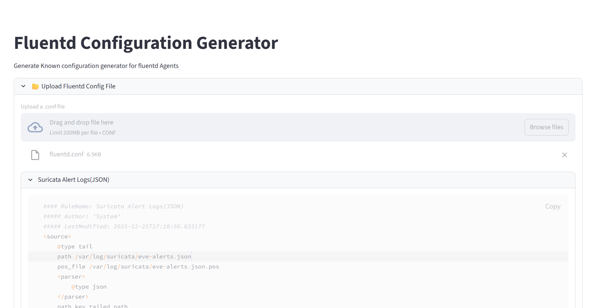

# FluentdConfigParserAndGenerator
Parse and Generate Fluentd Configuration Files (UI)
- [ ] Upload and Parse the existing configuration files
    - [x] Source configurations
    - [ ] Filter configurations
    - [ ] Output configurations
- [ ] Add new configurations
- [ ] Edit exiting configurations 
- [ ] Save and Download configured files

Snapshots: 
